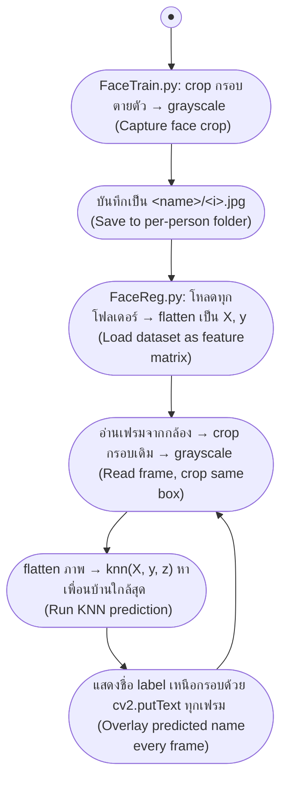

# Face Recognition ด้วย KNN (K-Nearest Neighbors)

<span class="material-symbols-outlined">arrow_back</span> กลับไปที่ [[Week04-MOC|MOC สัปดาห์ 04]]

## <span class="material-symbols-outlined">key</span> Keyword

- **K-Nearest Neighbors (KNN)** — จำแนกภาพใบหน้าโดยหาภาพใน dataset ที่ "ใกล้ที่สุด" (k=1) แล้วใช้ label ของภาพนั้นเป็นคำตอบ ไม่มีขั้นตอนเทรนโมเดลจริง (Lazy Learning)
- **Squared Euclidean Distance** — มาตรวัดระยะทางระหว่างเวกเตอร์ pixel สองภาพ ใช้ตัดสินว่าภาพไหน "ใกล้" ที่สุด
- **Flatten** — แปลงภาพ grayscale 2 มิติ (สูง×กว้าง) ให้เป็นเวกเตอร์ 1 มิติ ก่อนนำไปคำนวณระยะทาง
- **Instance-based Learning** — กลุ่มอัลกอริทึมที่ไม่มีขั้นตอน "เทรน" แยกจาก "ทำนาย" เหมือนโมเดลอื่น ๆ (เช่น Neural Network) แต่ใช้ข้อมูลตัวอย่างทั้งหมดตอนทำนายโดยตรง

## <span class="material-symbols-outlined">menu_book</span> Theory (เข้าใจง่าย)

โปรเจกต์นี้แบ่งเป็น 2 สคริปต์ที่ทำงานต่อกัน:

### 1. `FaceTrain.py` — เก็บ Dataset

เปิดกล้อง (1280×720) แล้ววาดกรอบสีแดงขนาดคงที่ 350×450 กึ่งกลางเฟรมไว้ให้ผู้ใช้เอาหน้าเข้าไปอยู่ในกรอบ ทุกครั้งที่กด **`s`** จะ crop เฉพาะพื้นที่ในกรอบ แปลงเป็น grayscale แล้วบันทึกเป็น `<ชื่อคน>/<ลำดับ>.jpg` กด **`q`** เพื่อออก

> [!tip] เคล็ดลับ
> ต้องคลิกโฟกัสหน้าต่าง "frame" ก่อนกดปุ่ม เพราะ `cv2.waitKey()` รับคีย์ได้เฉพาะตอนหน้าต่าง OpenCV มีโฟกัสเท่านั้น (กดที่ terminal หรือ editor จะไม่ทำงาน)

### 2. `FaceReg.py` — เทรน + ทำนายชื่อแบบเรียลไทม์

โหลดทุกโฟลเดอร์ (ชื่อโฟลเดอร์ = label ของคนนั้น) ในไดเรกทอรีปัจจุบัน อ่านทุกไฟล์ `.jpg` เป็น grayscale แล้ว flatten เก็บเป็นเมทริกซ์ `X` (feature) และ `y` (label) — ขั้นตอนนี้คือ "การเทรน" ของ KNN ซึ่งจริง ๆ แล้วแค่โหลดข้อมูลเก็บไว้เฉยๆ ไม่มีการปรับพารามิเตอร์ใด ๆ

จากนั้นเปิดกล้องแบบเดียวกับ `FaceTrain.py` แต่ในแต่ละเฟรม:
1. Crop พื้นที่ในกรอบเดิม (350×450) แปลงเป็น grayscale
2. Flatten ภาพแล้วส่งเข้าฟังก์ชัน `knn()` เพื่อหาภาพใน dataset ที่ระยะทาง (squared Euclidean) น้อยที่สุด แล้วแสดงชื่อ label นั้นกำกับไว้เหนือกรอบ**ทุกเฟรมเสมอ** (ไม่มีการเช็คว่ามีใบหน้าจริงอยู่ในกรอบหรือไม่ — เป็น pure KNN classification ล้วน ๆ ตามโจทย์)

```python
def knn(X, y, z, k=1):
    d = np.sum((X - z) ** 2, axis=1)   # ระยะทางจาก z ไปยังทุกภาพใน X
    idx = np.argsort(d)[:k]             # เลือก k เพื่อนบ้านที่ใกล้ที่สุด
    cls, vote = np.unique(y[idx], return_counts=True)
    return cls[np.argmax(vote)]         # โหวตหา label ที่เจอบ่อยที่สุดใน k ตัว
```

### ขอบเขตการออกแบบที่ตั้งใจไว้ (จากการทบทวนก่อนเริ่มพัฒนา)

| ประเด็น | การตัดสินใจ | เหตุผลสั้น ๆ |
| --- | --- | --- |
| ค่า `k` | `k=1` | ตรงกับโค้ดต้นแบบของแล็บ เรียบง่ายที่สุด |
| Distance metric | Squared Euclidean | มาตรฐานสำหรับ pixel-based KNN |
| Feature | Raw pixel (ไม่ลดมิติด้วย PCA) | โจทย์เน้นสาธิต KNN ล้วน ๆ dataset เล็กพอที่ raw pixel ยังรันไหว |
| Preprocessing | ไม่มี normalization/histogram equalization | ลดความซับซ้อน ยังไม่จำเป็นสำหรับ scope นี้ |
| คนแปลกหน้า (Unknown) | ไม่มี threshold ระยะทาง — ทายเป็นคนใกล้สุดในฐานเสมอ | โจทย์เน้นแค่จำแนกระหว่างคนที่เทรนไว้ |
| การตรวจจับใบหน้า (Face detection) | ไม่มี — ทำนายจากพื้นที่ในกรอบตายตัวทุกเฟรมเสมอ (เอา Haar Cascade ออกแล้ว) | โจทย์คือ "ใช้ KNN classification" ล้วน ๆ ไม่ต้องมีตัวตรวจจับหน้าแยก |
| พื้นที่ที่ใช้ทำนาย | กรอบตายตัว | ตรงกับวิธีเก็บ dataset |

> [!important] ข้อจำกัดที่ควรรู้
> เพราะไม่มี threshold ระยะทาง ถ้าเอาหน้าคนที่ไม่เคยเทรนเข้ากรอบ ระบบจะยังทายว่าเป็นคนที่ใกล้เคียงที่สุดในฐานเสมอ (ไม่มีทาง "Unknown") — เป็นข้อจำกัดโดยตั้งใจของ scope แล็บนี้ ไม่ใช่บั๊ก

### วิธีรัน

```bash
# 1. เก็บ dataset ของแต่ละคน (แก้ตัวแปร name ในไฟล์ก่อนรันแต่ละครั้ง)
python FaceTrain.py

# 2. เทรน + ทดสอบทำนายชื่อแบบเรียลไทม์
python FaceReg.py
```

**หมายเหตุ dependency:** โปรเจกต์นี้ pin `opencv-python==4.10.0.84` ไว้ (ไม่ใช้เวอร์ชัน `5.0.0.x` ที่เพิ่งออก) เพราะเวอร์ชัน `5.0.0.x` ไม่ได้ build โมดูล `objdetect` มาด้วย ทำให้ `cv2.CascadeClassifier` ใช้ไม่ได้ — ตอนนี้โค้ดไม่ได้เรียกใช้ `CascadeClassifier` แล้ว แต่คงเวอร์ชันนี้ไว้เผื่ออนาคตอยากกลับมาใช้ Haar Cascade อีก

## <span class="material-symbols-outlined">schema</span> Diagram



**ตัวอย่าง:** dataset ปัจจุบันมี 2 คน — `Arm` (117 รูป) และ `Jack` (243 รูป) เก็บด้วยกรอบขนาด 350×450 พิกเซล กึ่งกลางเฟรมกล้อง 1280×720

---
